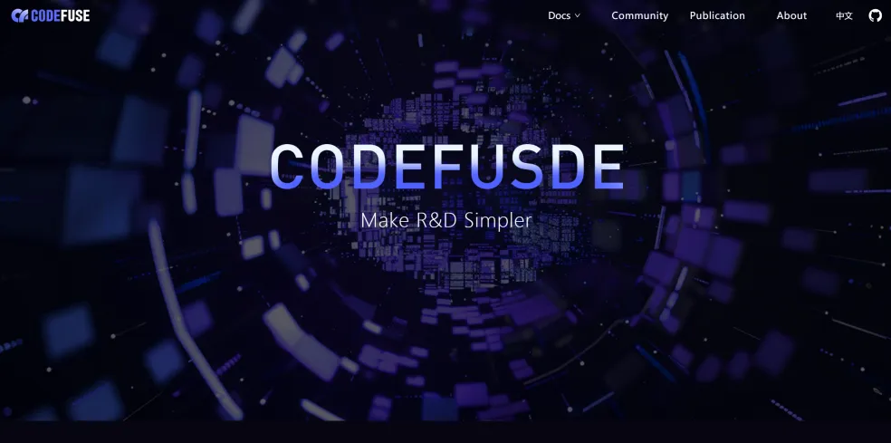

<p align="center">
  
</p>

<div align="center">

[**简体中文**](./README_ZH.md)|[**HuggingFace**](https://huggingface.co/codefuse-ai)|[**ModelScope**](https://modelscope.cn/organization/codefuse-ai)

Hello! This is CodeFuse!
CodeFuse's mission is to develop large-scale code language models (Code LLMs) specifically designed to support the entire software development lifecycle, covering key stages such as design, requirements, coding, testing, deployment, operations, and more. We are committed to creating innovative solutions to make the process of software development as smooth as silk for developers.

</div align="center">

## CodeFuse Open Source Website

### Quick Access

You can quickly access the CodeFuse open source website by visiting https://codefuse-ai.github.io/
Here, you can learn about the following:

- We will share the background story of the CodeFuse project, how it was initiated, and the philosophy behind it
- The main page showcases a series of AI development projects involving the entire software development lifecycle
- Detailed documentation is provided on the documentation page to help you understand the project more deeply
- During the project development process, we will also synchronize the latest version updates and progress of the CodeFuse project in real time, and display the key functions and features of the project
- We welcome questions and contributions, providing contribution guidelines and principles here on how to submit issues, improve code or documentation
- Similarly, we will showcase CodeFuse's latest academic achievements and technical articles in Publications
  We hope the above content will help you understand CodeFuse better!
  

### Quick Modification

1. Clone the repo

```
git clone https://github.com/codefuse-ai/codefuse-ai.github.io.git
cd codefuse-ai.github.io.git
```

2. Check your node version

```bash
node -v
# if your version is wrong
nvm install <version>
nvm use <version>
```

3. Install repo dependency

```bash
npm cache clean --force # clean cache
npm install
```

4. Start local codefuse-ai site

```bash
#you can check it by npm-start if you have any changes before you push
npm start
```

### Basic Introduction

| CodeFuse Domain   | Function                                                                                                                                                                          | Philosophy                                                                      |
| ----------------- | --------------------------------------------------------------------------------------------------------------------------------------------------------------------------------- | ------------------------------------------------------------------------------- |
| Code Domain       | Aimed at enhancing multitasking capabilities of large prediction models                                                                                                           | Integrating knowledge seamlessly, the code manifests naturally                  |
| Operations Domain | Aimed at integrating RAG, tool learning, EKG, and other technologies to improve efficiency in the software development lifecycle                                                  | In procedural programming, the process itself is the outcome                    |
| Analysis Domain   | Meets the needs for large-scale, complex codebase analysis, adapting to diverse static analysis scenarios                                                                         | Insight your code, as you wish                                                  |
| Testing Domain    | Builds the "intelligence" in the testing domain, integrating large models and engineering technologies in the quality domain to promote the upgrade of quality technology         | TestAgent: Your Online Testing Assistant                                        |
| Inference Domain  | Caches generated model results to reduce response time for similar requests, enhancing user experience                                                                            | Driving High Performance, Delivering Instant Intelligence                       |
| Evaluation Domain | Constructs evaluation benchmarks in the development programming domain to assess model performance in tasks like code completion, code generation, test case generation, and more | High-Efficiency, Precise Feedback - Enterprise Multi-Task Benchmarking for CLLM |

## Further Updates

1. We will continue to improve the content of the documentation to provide better technical support.
2. A Blog page will be added to continuously synchronize the latest technology/technical applications/academic forefront articles of CodeFuse.
3. CodeFuse's online community activities, including newcomer task plan reference cases, community co-construction plan reference cases, etc., will also be synchronized here.

## About the CodeFuse Team

The CodeFuse team consists of a group of passionate members. Our goal is to build large-scale coding language models (Code LLMs) to support and enhance AI-native development work throughout the entire software development lifecycle. Our work covers key segments from design requirements, writing code, testing, building, deployment, operations to insight analysis. We actively promote the spirit of open source and have launched 15 code-related models and open-sourced a series of technical tools, such as MFTCoder, CodeFuse-VLM, CodeFuse-DevOps, CodeFuse-Query, TestGPT, and CodeFuse-muAgent. Moreover, to allow users to benefit directly in their daily coding work, we have also developed the CodeFuse-IDE plugin. Additionally, the CodeFuse team has had 6 technical papers accepted by top conferences, with technical stacks involving semantic retrieval, context enlargement, large model training fine-tuning, large model inference acceleration, and other large model technology fields. We have also participated in standards setting with the CICT and ITU, winning multiple domestic industry awards, and have been granted two software monographs. We warmly welcome communication, and if you are interested in this exciting work, please join us!

## Contact Us

CodeFuse's related models and datasets are also being continuously open-sourced. If you like our work, we welcome you to try it out, point out errors, and contribute code. If possible, please.


