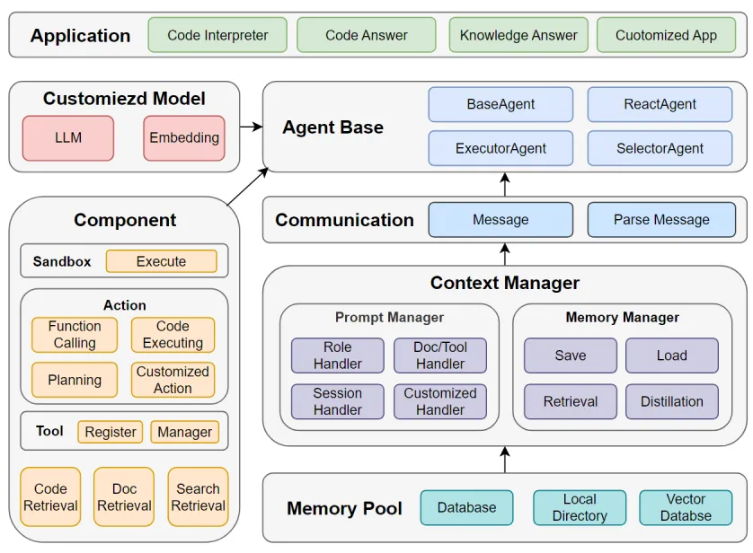

在这个信息技术爆炸的时代，我们都知道大型语言模型（LLM）拥有处理复杂问题的能力，但当遇到编程难题这种更高级的挑战时，单独的 LLM Agent 可能就不够看了。社区里动起了脑筋，玩出了新花样——组合多个 Agent 来应对高难度挑战！正如 Multi Agent 的构建过程所示，与其说我们是在设计 Agents，不如说是对当前需求的深入理解后去构建出一条专属于某个场景的 SOP。

> 功能演示：在 muAgent 里能够实现本地代码库的问答功能

1、能够支持 java 代码库导入，并转换成向量数据、图数据以及传统数据库的内容

```python
# delete codebase
codebase_name = 'client_local'
code_path = "D://chromeDownloads/devopschat-bot/client_v2/client"
# initialize codebase
use_nh = True
do_interpret = True
cbh = CodeBaseHandler(codebase_name, code_path, crawl_type='dir', use_nh=use_nh, local_graph_path=CB_ROOT_PATH,
                      llm_config=llm_config, embed_config=embed_config)
cbh.import_code(do_interpret=do_interpret)
```


2、在有了代码库之后，就可以基于语言模型来完成代码库问答

```python

#
phase_name = "codeChatPhase"
phase = BasePhase(
    phase_name, embed_config=embed_config, llm_config=llm_config,
)

#
query_content = "remove 这个函数是做什么的"
query = Message(
    role_name="user", role_type="human", input_query=query_content,
    code_engine_name=codebase_name, score_threshold=1.0, top_k=3, cb_search_type="tag",
    local_graph_path=CB_ROOT_PATH, use_nh=use_nh
    )
output_message3, output_memory3 = phase.step(query)
# print(output_message3)
print(output_memory3.to_str_messages(return_all=True, content_key="parsed_output_list"))
```


3、下面，我们还可以基于代码库完成代码库转 API 文档工作，代码库自动生成测例的工作


> 那我们的 muAgent 是如何完成 multi-agent 的涉及工作的呢？

🏗️【muAgent 框架大揭秘】 想象一下，你现在需要去用 LLM 来串联专属你的个性化业务场景 SOP 流程。那按照正常的 Agent 开发流程，我们首先需要定义每一个 Agent 的 Prompt，其次将 prompt 传入到 LLM 接口进行调用，并将当前 Agent 的输出进行特定逻辑的后处理，再合并到下一个 Agent 的 Prompt 上，去获取它的输出，重复上述流程直到任务完成。而当这个 SOP 流程较长和复杂时，反复定义这样的 Agent 以及多种后处理会显得过于繁琐。

那 muAgent 就是为了解决这个问题并帮助大家快速实现 SOP 的串联。为了快速定义了 Agent 交互链路，我们要理解 multi-agent 的核心过程就在于如何把上一个 agent 的输出给到下一个 agent 的输入，其中需要涉及到 llm 的输出、具体 action 的执行以及信息的解析处理。为此，muAgent 巧妙地设计了 Memory Manager 和 Prompt Manager 两个杀手级组件，能够管理长篇的聊天历史记录和自动化构筑 Prompts 。从而打造了一个扩展性满满、易用性爆表的多 Agent 超级框架！

<div align=center>
  
</div>

✨【四种 Agent 类型，满足你的一切幻想】在 Agent 层面，提供四种基本的 Agent 类型，对这些 Agent 进行 Role 的基础设定，可满足多种通用场景的交互和使用。所有的 Action 都由 Agent 执行。

- BaseAgent：基础功打得溜，问答、工具使用、代码执行样样行。
- ReactAgent：标准 React 流，遇事不慌，标准反应流程轻松应对。
- ExecutorAgent：对任务清单进行顺序执行，根据 User 或 上一个 Agent 编排的计划，完成相关任务，排个队，挨个干！
- SelectorAgent：挑三拣四，根据 User 或 上一个 Agent 的问题选择合适的 Agent，总能找到最合适的 Agent 回答用户需求。


🔁【Communication 进化论】 信息如同血液，Agent 之间的通信变得前所未有的流畅，各类重要数据在 Agents 间如同接力赛跑，无缝传递！

- System Content：用于存储管理当前 LLM 输出的时间，Role 信息等
- Info Content：LLM 辅助信息，比如像知识库查询信息、代码库检索信息、工具信息、Agent 信息等
- LLM Content：直接存储和传递 LLM 产生的信息
- LLM Parsed Content：对 LLM 进行解析转成更易操作的 key-value 数据结构，方便对 LLM 内容进行过滤
- Customized Content：用于管理自定义 action 产生的 key-value 数据内容，用于后续自定义 Prompt 模板的组装构建

🤖【Memory Manager 记忆强化】 你的虚拟开发团队记忆力惊人，不管是保存、压缩还是检索聊天历史，他们能在数据库的海洋中自如潜泳。

- 存储管理：在数据库或本地实现对 chat history 进行 save 和 load 管理，包括 user input、 llm output、observation ouput
- 信息压缩：对 chat history 进行关键信息压缩总结 summary context，比如说单文本概况、侧重不同角度进行文本概况、关键信息提取、多文本概况，作为 Prompt context
- 记忆检索：提供基础检索功能，检索 chat history 或者 Summary Context 中与问题相关信息，辅助问答

🛠️【Prompt Manager – 大脑核心】如何让多个大模型分工并协调好 LLM 并来引导它们产生期望的输出，其本质就是将业务问题抽象并拆解到可执行的 Prompt，让他们像处理业务问题一样精准执行。Prompt Manager 正是这个大脑——将各类 Prompts 巧妙组装，从而驱动 LLM Agents 发挥出惊人的生产力！

muAgent 将 Prompt Manager 模块中分为 System Prompt、Context Prompt、Customized Prompt 三部分

- System Prompt 包括 Role Name、Role Description、Task 等，即希望模型执行的特定任务。
- Context Prompt 包括 Doc Context、Code Context、Tool Context、Agent Context、Session Context 等，即希望模型理解的请求所需的背景信息。
- Customized Prompt 则是 自定义的一些 Input 和 Ouput，即模型需要处理的数据和期望的输出类型或格式的信号。


💻【Retrieval、Tool、Action – 辅助生态组件，muAgent 框架的得力小助手】

- Retrieval：好比虚拟团队的知识库管理员，有求必应。集成了 Doc、Internet Search、Code Retrieval 三种检索信息的方式，定义了一个抽象 IMRetrieval 类，可支持开发者自定义个性化的知识库，来完成 Agent 的知识库注册。
- Tool：工具百宝箱，任你挑选，一键调用解决问题。支持 Agent 完成 Tool 的注册和 langchain Tool 接口的直接使用。
- Action：作为 LLM 具体要执行的动作或动作流，会包括 LLM 信息处理、知识检索、工具调用以及代码执行等一个综合性的复杂过程，只要下达指令，他们就能将计划变成现实。

🏡【私人定制不是梦】 更炫的是，muAgent 框架支持私有化定制，无论是个性化的 LLM 还是深情的嵌入式 Embedding 服务，只要你想，就能搞定！

🌟 所以，还等什么？让我们一同携手 muAgent 框架，解锁编程世界的新潜力，体验创造力的大爆炸吧！🎉🎉🎉

通过 执行`pip install codefuse-muagent` 然后就能上手使用了

```python
from muagent.connector.agents import ReactAgent, SelectorAgent
from muagent.connector.schema import Role, Message, ChainConfig
from muagent.llm_models.llm_config import EmbedConfig, LLMConfig


llm_config = LLMConfig(
    model_name=model_name, api_key=api_key,  api_base_url=api_base_url, temperature=0.3,
    stop="**Observation:**"
)

embed_config = EmbedConfig(
    embed_engine="model", embed_model=embed_model, embed_model_path=embed_model_path
)

# 定义了基于react的tool agent
tool_role = Role(role_type="assistant", role_name="tool_reacter", prompt=REACT_TOOL_PROMPT)
tool_react_agent = ReactAgent(role=tool_role,chat_turn=3,
    llm_config=llm_config, embed_config=embed_config,
)

# 定义了基于react的code agent
code_role = Role(role_type="assistant", role_name="code_reacter", prompt=REACT_CODE_PROMPT)
code_react_agent = ReactAgent(role=code_role, chat_turn=3,
    llm_config=llm_config, embed_config=embed_config,
)

prompt = """#### Agent Profile
Your goal is to response according the Context Data's information with the role that will best facilitate a solution, taking into account all relevant context (Context) provided.
When you need to select the appropriate role for handling a user's query, carefully read the provided role names, role descriptions and tool list.
#### Response Output Format
**Thoughts:** think the reason step by step about why you selecte one role
**Role:** Select the role from agent names.
"""

# 定义了一个groupAgent
role = Role(role_type="assistant", role_name="qaer", prompt=prompt)
base_agent = SelectorAgent(role=role,chat_turn=3,
    llm_config=llm_config, embed_config=embed_config,
    group_agents=[tool_react_agent, code_react_agent]
)

#
question = "确认本地是否存在employee_data.csv，并查看它有哪些列和数据类型;然后画柱状图"
query = Message(role_type="user", role_name="user", input_query=question,tools=tools,)
output_message = base_agent.step(query)
print(output_message.role_content)
```

还可以支持 CodeFuse-Chatbot 的多种问答功能，CodeFuse-Chatbot 使用演示视频：

[https://www.youtube.com/watch?v=ex5sbwGs3Kg&ab_channel=HaotianZhu](https://www.youtube.com/watch?v=ex5sbwGs3Kg&ab_channel=HaotianZhu)

> 项目链接
>
> [1] https://github.com/codefuse-ai/CodeFuse-muAgent
>
> [2] [https://github.com/codefuse-ai/codefuse-chatbot](https://github.com/codefuse-ai/codefuse-chatbot)
>
> [3] [https://github.com/codefuse-ai](https://github.com/codefuse-ai)
