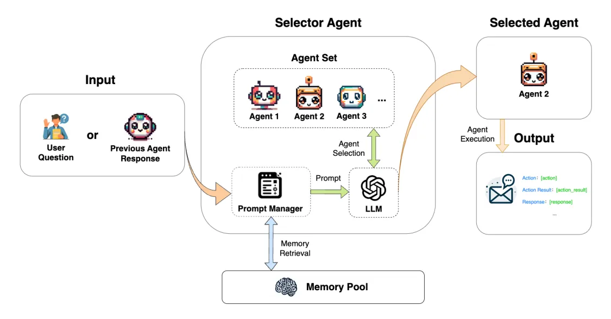

---
group:
  title: 智能体
  order: 5
title: 小组·智能体
order: 3
toc: content
---

`GroupAgent`提供基础问答、工具使用、代码执行的功能，实现小组调度执行的过程，输入 => agent => 输出

<div align=center>
  
</div>

## GroupAgent 使用

### 填写模型配置

```python
from muagent.schemas import ModelConfig
import json, os

MODEL_CONFIGS = {
    "qwen_chat": {
        "model_type": "qwen_chat",
        "model_name": "qwen2.5-72b-instruct" ,
        "api_key": "sk-xxx",
    },
}
os.environ["MODEL_CONFIGS"] = json.dumps(MODEL_CONFIGS)
```

### 填写智能体配置

```python
tools = ["KSigmaDetector", "MetricsQuery"]
role_prompt = "you are a helpful assistant!"

AGENT_CONFIGS = {
    "grouper": {
        "agent_type": "GroupAgent",
        "agent_name": "grouper",
        "agents": ["codefuse_reacter_1", "codefuse_reacter_2"]
    },
    "codefuse_reacter_1": {
        "agent_type": "ReactAgent",
        "agent_name": "codefuse_reacter_1",
        "tools": tools,
    },
    "codefuse_reacter_2": {
        "agent_type": "ReactAgent",
        "agent_name": "codefuse_reacter_2",
        "tools": tools,
    }
}
os.environ["AGENT_CONFIGS"] = json.dumps(AGENT_CONFIGS)
```

### 初始化配置

```python
from muagent import get_ekg_project_config_from_env
project_config = get_ekg_project_config_from_env()
```

### 初始化 agent

```python
from muagent.agents import BaseAgent
agent = BaseAgent.init_from_project_config(
    "grouper", project_config
)
```

### 响应用户请求

```python

query_content = "帮我确认下127.0.0.1这个服务器的在10点是否存在异常，请帮我判断一下"
query = Message(
    role_name="human",
    role_type="user",
    content=query_content,
)
# agent.pre_print(query)
output_message = agent.step(query)
print("input:", output_message.input_text)
print("content:", output_message.content)
print("step_content:", output_message.step_content)
```
