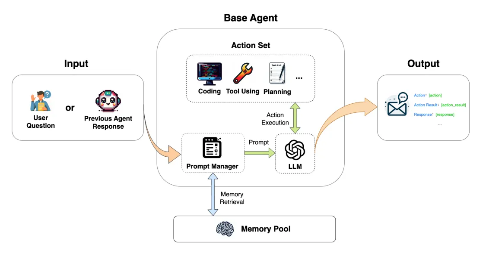

---
group:
  title: 智能体
  order: 5
title: 单步·智能体
order: 0
toc: content
---

`SingleAgent`提供基础问答、工具使用、代码执行的功能，实现单步执行的过程，输入 => 输出

<div align=center>
  
</div>

## SingleAgent 使用

### 填写模型配置

```python
from muagent.schemas import ModelConfig
import json, os

MODEL_CONFIGS = {
    "qwen_chat": {
        "model_type": "qwen_chat",
        "model_name": "qwen2.5-72b-instruct" ,
        "api_key": "sk-xxx",
    },
}
os.environ["MODEL_CONFIGS"] = json.dumps(MODEL_CONFIGS)
```

### 填写智能体配置

```python

role_prompt = """#### AGENT PROFILE
you are a helpful assistant!

#### RESPONSE OUTPUT FORMAT
**Action Status:** Set to 'stopped' or 'code_executing'.
If it's 'stopped', the action is to provide the final answer to the session records and executed steps.
If it's 'code_executing', the action is to write the code.

**Action:**
# Write your code here
...
"""

role_prompt = """#### AGENT PROFILE
you are a helpful assistant!

#### RESPONSE OUTPUT FORMAT
**Action Status:** Set to either 'stopped' or 'tool_using'. If 'stopped', provide the final response to the original question. If 'tool_using', proceed with using the specified tool.

**Action:** Use the tools by formatting the tool action in JSON. The format should be:

{
  "tool_name": "$TOOL_NAME",
  "tool_params": "$INPUT"
}
"""

role_prompt = "you are a helpful assistant!"
tools = ["KSigmaDetector", "MetricsQuery"]

AGENT_CONFIGS = {
    "codefuse_simpler": {
        "agent_type": "SingleAgent",
        "agent_name": "codefuse_simpler",
        "llm_config_name": "qwen_chat",
        "system_prompt": role_prompt,
    }
}
os.environ["AGENT_CONFIGS"] = json.dumps(AGENT_CONFIGS)
```

### 初始化配置

```python
from muagent import get_ekg_project_config_from_env
project_config = get_ekg_project_config_from_env()
```

### 初始化 agent

```python
from muagent.agents import SingleAgent, BaseAgent

# one
agent = BaseAgent.init_from_project_config(
    "codefuse_simpler", project_config
)

# two
# base_agent = SingleAgent(
#     project_config=project_config,
#     tools=tools
# )
```

### 响应用户请求

```python
query_content = "帮我确认下127.0.0.1这个服务器的在10点是否存在异常，请帮我判断一下"
query = Message(
    role_name="human",
    role_type="user",
    input_text=query_content,
)
# base_agent.pre_print(query)
output_message = agent.step(query)
print("### intput ###\n", output_message.input_text)
print("### content ###\n", output_message.content)
print("### step content ###\n", output_message.step_content)


# question = "用python画一个爱心"
# query = Message(
#     role_type="human",
#     role_name="user",
#     content=question,
# )
# output_message = agent.step(query)
```
