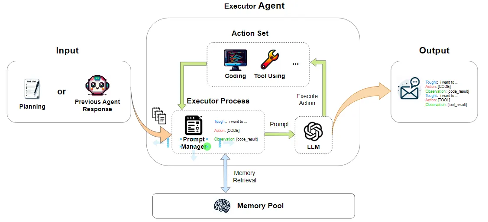

---
group:
  title: Agent
  order: 5
title: TaskAgent
order: 2
toc: content
---

`TaskAgent` provides basic functionalities for question-answering, tool usage, and code execution. It is designed to decompose tasks and execute them in a systematic manner, following the steps: input => task list => task execution => output.

<div align=center>
  
</div>

## Usage of TaskAgent

### Configure the Model

```python
from muagent.schemas import ModelConfig
import json, os

MODEL_CONFIGS = {
    "qwen_chat": {
        "model_type": "qwen_chat",
        "model_name": "qwen2.5-72b-instruct",
        "api_key": "sk-xxx",
    },
}
os.environ["MODEL_CONFIGS"] = json.dumps(MODEL_CONFIGS)
```

### Configure the Agent

```python
tools = ["KSigmaDetector", "MetricsQuery"]
role_prompt = "you are a helpful assistant!"

AGENT_CONFIGS = {
    "tasker": {
        "system_prompt": role_prompt,
        "agent_type": "TaskAgent",
        "agent_name": "tasker",
        "tools": tools,
        "llm_config_name": "qwen_chat"
    }
}
os.environ["AGENT_CONFIGS"] = json.dumps(AGENT_CONFIGS)
```

### Initialize Configuration

```python
from muagent import get_ekg_project_config_from_env
project_config = get_ekg_project_config_from_env()
```

### Initialize the Agent

```python
from muagent.agents import BaseAgent
agent = BaseAgent.init_from_project_config(
    "tasker", project_config
)
```

### Respond to User Requests

```python
query_content = "先帮我获取下127.0.0.1这个服务器在10点的数，然后在帮我判断下数据是否存在异常"
query = Message(
    role_name="human",
    role_type="user",
    content=query_content,
)
# agent.pre_print(query)
output_message = agent.step(query)
print("### input ###\n", output_message.input_text)
print("### content ###\n", output_message.content)
print("### step content ###\n", output_message.step_content)
```
