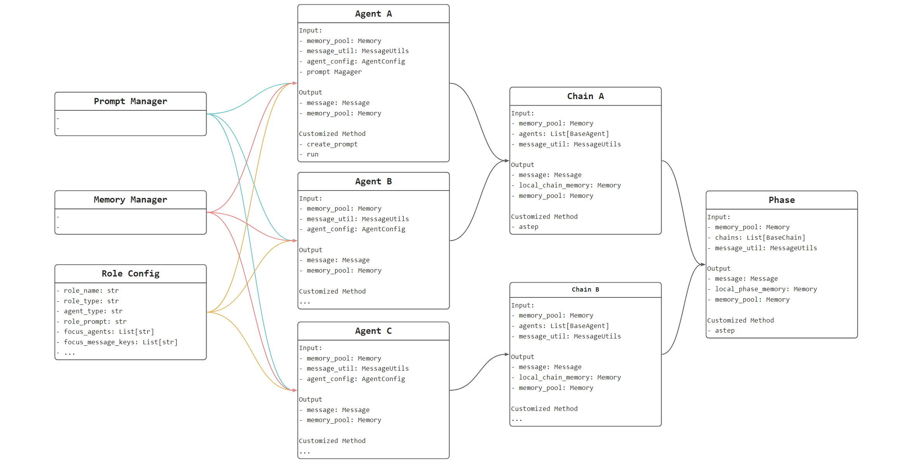

---
group:
  title: ❤️ Codefuse-muAgent
  order: -1
title: Agent Flow
order: 0
toc: content
---

## Introduction to Core Connectors

To facilitate everyone's understanding of the entire CoAgent link, we use a Flow format to detail how to build through configuration settings.

  

 Below, we first introduce the related core components 

### Agent

On the design level of the Agent, we provide four basic types of Agents, with Role settings for these Agents that can meet the interactions and uses of various common scenarios:

1. BaseAgent: Provides basic question answering, tool usage, and code execution functions, and realizes input => output according to the Prompt format.
2. ReactAgent: Provides standard React functionality, accomplishing current tasks based on questions.
3. ExecutorAgent: Performs sequential execution of task lists, completing related tasks according to plans arranged by the User or the previous Agent.
4. SelectorAgent: Provides the function of selecting an Agent, choosing the appropriate Agent to respond according to the question from the User or the previous Agent. After output, the message is pushed into the memory pool, which will later be managed by the Memory Manager.

It selects the appropriate Agent to respond based on the question from the User or the previous Agent. After output, the message is pushed into the memory pool, which is subsequently managed by the Memory Manager.

### Chain

Basic Chain: BaseChain, connects the interactions of agents, manages the related messages and memory.

### Phase

Basic Phase: BasePhase, connects the interactions of chains, and manages the related messages and memory.

### Prompt Manager

The prompt creation for each agent in the Mutli-Agent link:

- By setting simple prompt_input_keys and prompt_output_keys, the preset Prompt Context creation logic can be followed to quickly configure the agent prompt.
- It is also possible to design a new key-context in the prompt manager module, achieving personalized Agent Prompt.

### Memory Manager

Mainly used for the management of chat history:

- Manages the reading and writing of chat history in a database, including user input, llm output, doc retrieval, code retrieval, search retrieval.
- Summarizes the key information in chat history to create a summary context, which serves as a prompt context.
- Provides a retrieval function to search for information related to the question in the chat history or summary context, assisting with question answering.
