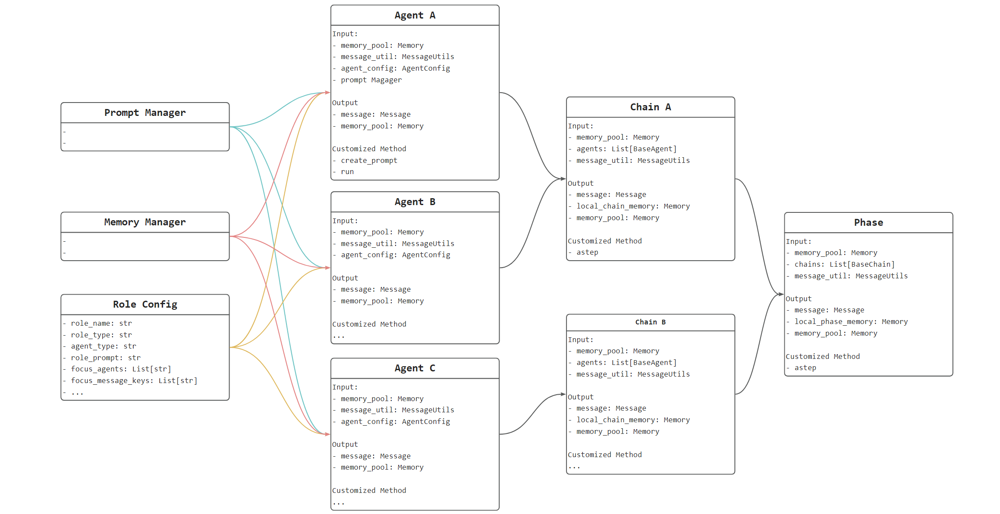

---
group:
  title: ❤️ Codefuse-muAgent
  order: -1
title: Agent 编排
order: 0
toc: content
---

## 核心 Connector 介绍

为了便于大家理解整个 CoAgent 的链路，我们采取 Flow 的形式来详细介绍如何通过配置构建

  

 下面，我们先介绍相关的核心组件 

### Agent

在 Agent 设计层面，我们提供了四种基本的 Agent 类型，对这些 Agent 进行 Role 的基础设定，可满足多种通用场景的交互和使用

1. BaseAgent：提供基础问答、工具使用、代码执行的功能，根据 Prompt 格式实现 输入 => 输出

2. ReactAgent：提供标准 React 的功能，根据问题实现当前任务

3. ExecutorAgent：对任务清单进行顺序执行，根据 User 或 上一个 Agent 编排的计划，完成相关任务

4. SelectorAgent：提供选择 Agent 的功能，根据 User 或 上一个 Agent 的问题选择合适的 Agent 来进行回答.

输出后将 message push 到 memory pool 之中，后续通过 Memory Manager 进行管理

### Chain

基础链路：BaseChain，串联 agent 的交互，完成相关 message 和 memory 的管理

### Phase

基础场景：BasePhase，串联 chain 的交互，完成相关 message 和 memory 的管理

### Prompt Manager

Mutli-Agent 链路中每一个 agent 的 prompt 创建

- 通过对 promtp_input_keys 和 promtp_output_keys 对的简单设定，可以沿用预设 Prompt Context 创建逻辑，从而实现 agent prompt 快速配置
- 也可以对 prompt manager 模块进行新的 key-context 设计，实现个性化的 Agent Prompt

### Memory Manager

主要用于 chat history 的管理

- 将 chat history 在数据库进行读写管理，包括 user input、 llm output、doc retrieval、code retrieval、search retrieval
- 对 chat history 进行关键信息总结 summary context，作为 prompt context
- 提供检索功能，检索 chat history 或者 summary context 中与问题相关信息，辅助问答
