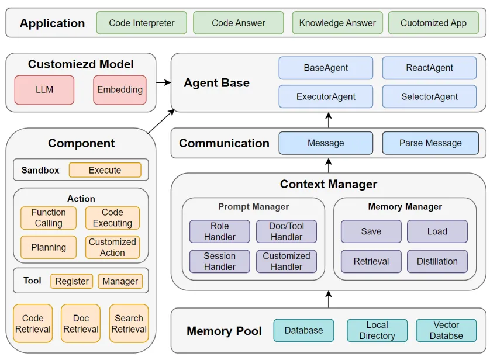
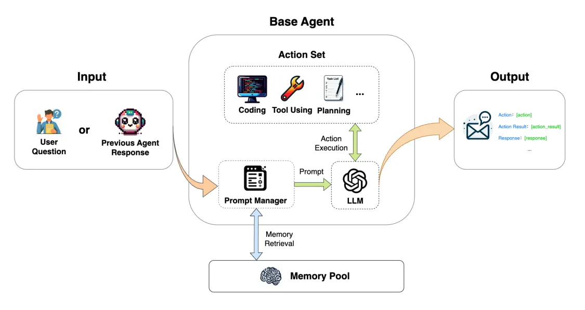
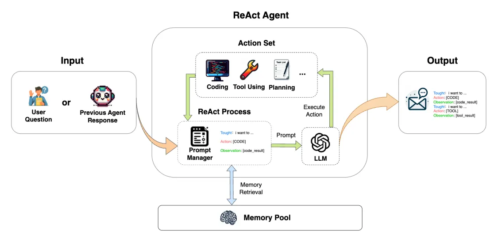
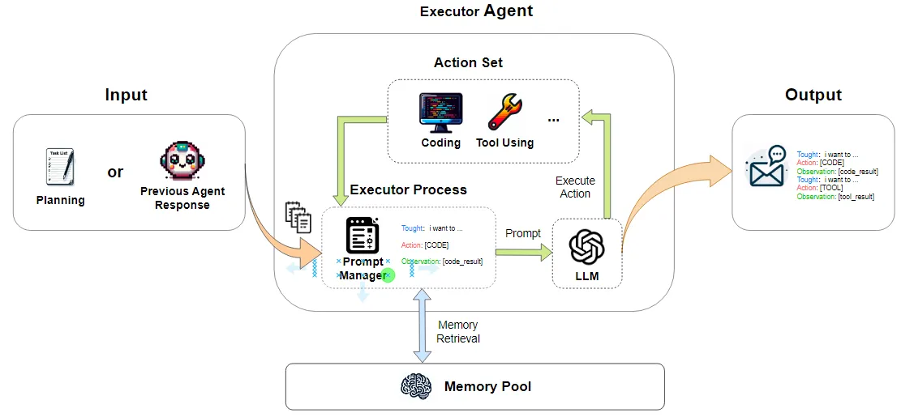
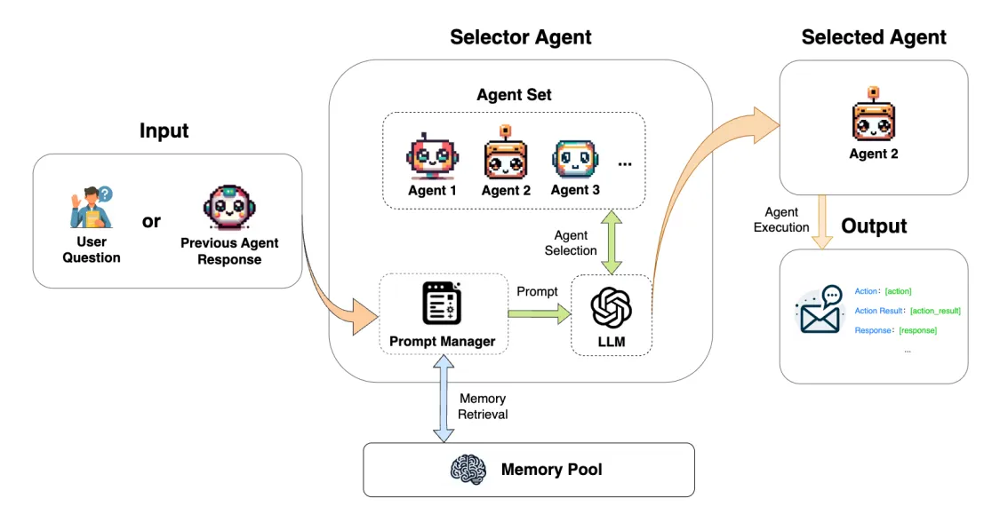

---
nav:
  title: Docs
  order: -1
  second:
    title: API-Docs
    order: 0
group:
  title: ❤️ Codefuse-muAgent
  # index: true
  order: -1
title: muAgent
order: -1
toc: content
---

# Introduction

To enhance the performance of large models in terms of inference accuracy, various innovative Large Language Model (LLM) playbooks have emerged in the industry. From the earliest Chain of Thought (CoT) and Thread of Thought (ToT) to Games on Tracks (GoT), these methods have continually expanded the capability boundaries of LLMs. When handling complex problems, we can select, invoke and execute tool feedback through the ReAct process, while realizing multi-round tool use and multi-step execution.

However, for more complex scenarios, such as the development of complex code, a single-function LLM Agent is clearly not up to the task. Therefore, the community has begun to develop combinations of multiple Agents, such as projects focused on the development field like metaGPT, GPT-Engineer, and chatDev, as well as the AutoGen project that focuses on automating the construction of Agents and Agent dialogue.

After an in-depth analysis of these frameworks, it has been found that most Agent frameworks are highly coupled, with poor usability and extensibility. They implement specific scenarios in preset settings, but expanding to new scenarios can be very challenging.

Therefore, we hope to build an extensible, easy-to-use Multi-Agent framework to support ChatBots in retrieving knowledge base information while assisting with various general tasks such as daily office work, data analysis, development, and operations.

This project's Multi-Agent framework incorporates excellent designs from multiple frameworks, such as the message pool from metaGPT and the agent selector from autogen.

  

# MuAgent Framework

In MuAgent, in addition to defining the Agent interaction link and AgentBase basic execution flow, we have also designed two basic components: Prompt Manager and Memory Manager, which are used for automated construction of Prompts and chat history management, respectively. We have built an extensible, easy-to-use Multi-Agent framework, including the following content:

- **Agent Base:** Established four basic types of Agents – BaseAgent, ReactAgent, ExecutorAgent, SelectorAgent – to support basic activities in various scenarios.
- **Communication:** Completes the transfer of information between Agents through Message and Parse Message entities, and interacts with Memory Manager to manage memory in the Memory Pool.
- **Prompt Manager:** Automates the assembly of Customized Agent Prompts through Role Handler, Doc/Tool Handler, Session Handler, Customized Handler.
- **Memory Manager:** Supports storage management of chat history, information compression, memory retrieval, and finally storage in databases, local or vector databases through the Memory Pool.
- **Component:** Auxiliary ecosystem components for building Agents, including Retrieval, Tool, Action, Sandbox, etc.
- **Customized Model:** Supports the integration of private LLM and Embedding.

## Agent Base

At the Agent level, we provide four basic types of Agents, with Role settings for these Agents that can meet the interactions and uses of various common scenarios. All Actions are executed by Agents.

1. BaseAgent: Provides basic question answering, tool usage, and code execution functions, and realizes input => output according to the Prompt format.

  

2. ReactAgent: Provides standard React functionality, according to questions to execute current tasks.

  

3. ExecutorAgent: Sequentially executes a list of tasks, completing related tasks according to plans arranged by the User or the previous Agent. The Agent receives a task list ([List[task]) and loops through the tasks (Feedback Agents can also be added in the middle for task re-optimization), until the task is complete.

  

4. SelectorAgent: Provides the function of selecting an Agent, choosing the appropriate Agent to respond based on the question from the User or the previous Agent.

  

## Communication

To enable better interaction between Agents, as well as to provide each Agent with enough information to complete their specific tasks, we have divided the Message information body into several parts, such as System Content, Info Content, LLM Content, and LLM Parsed Content, etc.

System Content: Used to store and manage the timing of the current LLM output, Role information, etc.
Info Content: LLM auxiliary information, such as knowledge base query information, code library retrieval information, tool information, Agent information, etc.

LLM Content: Directly stores and conveys information generated by the LLM.
LLM Parsed Content: Parses the LLM's output into a more manageable key-value data structure, making it easier to filter through LLM content.
Customized Content: Manages key-value data content generated by custom actions, used for subsequent assembly and construction of custom Prompt templates.
By defining the above message formats, we can accomplish the transfer and management of general messages. Specific assembly methods can be seen in the Prompt Manager module.

## Context Manager

### Memory Manager

Mainly used for the management of chat history:

- Storage Management: Implements the save and load management of chat history in the database or locally, including user input, LLM output, observation output.
- Information Compression: Summarizes key information from the chat history into a summary context, such as single text summaries, summaries from different angles, key information extraction, multi-text summaries, and serves as Prompt context.
- Memory Retrieval: Provides basic retrieval functions, retrieving information related to questions from chat history or Summary Context to assist in Q&A.
- LLM Automatic Trigger: Future definitions of policies or the use of LLM to trigger the compression summary and retrieval functions.

### Prompt Manager

Asking LLMs has become common practice, but how to coordinate the planning and usage of tools, code writing abilities among multiple large models to guide their expected outputs has become a key issue. Essentially, this involves abstracting business problems into executable Prompts, so we're not just designing Agents but rather engaging in framework design after a deep understanding of the current demands.

In actual business scenarios where LLMs are involved (excluding the SFT process), we can designate LLM to complete specific tasks and obtain expected outputs through the design of Agent Prompt content. In the process of MuAgent, the Prompt is divided into three parts: System Prompt, Context Prompt, Customized Prompt.

- System Prompt includes Role Name, Role Description, Task, etc.
- Context Prompt includes Doc Context, Code Context, Tool Context, Agent Context, Session Context, etc.
- Customized Prompt involves custom inputs and outputs, such as...
  We can also ask the model to output structured texts, such as the JSON string of a tool, code\ncode_content, etc., to complete particular workflows.

**Automatic Prompt Assemble**

After defining the structure as above, we can complete the automation assembly of Prompts in the following ways, without having to make extensive adjustments to the prompt each time:

1. Upon defining an Agent, configure Role Name, Role Description, Task, etc., to determine what the Agent needs to do.
2. Pre-package some reusable Context Prompt general strategies, such as selectable Role's SessionContext, configurable Tool, Code Retrieval, Doc Retrieval, Search Retrieval, Agent to complete corresponding assemblies.
3. As the Agent's Prompt requires relatively personalized operations, it also supports the addition of new key-context designs within the Prompt Manager module to achieve personalized Agent Prompts.

**Automatic Prompt Design**
Able to automatically design the best prompt based on role description, task, query, etc.; to be defined...

**Multi Prompt Design**
Based on the previous definition of Prompt, we know that a Prompt consists of three parts: System Prompt, Context Prompt, Customized Prompt. Any changes in the three parts may cause changes in the final output of the LLM.

For the same type of task, their System Prompt is the same. So, without considering the variations of Customiezd Prompt, it is possible to achieve the assembly differences of different contexts. For example, Prompt A obtains 10 rounds of chat history, while Prompt B uses 5 rounds of chat history, or alternatively, filters and compresses information in chat history.

To be implemented...

## Component

### Retrieval

In all Prompts' Contexts, aside from Chat History session information, information based on external document libraries, code repositories, internet search results is also relied upon. This knowledge system beyond the model parameters can significantly enhance the Agent's ability to complete complex tasks.

Thus, in MuAgent, we integrated three ways to retrieve information: Doc, Internet Search, Code Retrieval, and defined an abstract class IMRetrieval, supporting developers to customize their knowledge bases to complete the Agent's knowledge base registration.

**Doc Retrieval**

Document vector databases are currently the mainstream method for building knowledge bases, using Text Embedding models to vectorize documents and store them in vector databases. In the future, we will also support queries based on knowledge graphs and automatically extract entities and relations through large models to explore the complex relationships in data.

**Code Retrieval**

LLMs face the challenge of lagging training data for code generation, repair, and component understanding tasks, as well as not being able to perceive the context-dependent structure of code. During development, understanding, retrieving and querying metadata from the existing codebase and dependencies can take a considerable amount of time. Hence, we hope to provide an external knowledge system

**Search Retrieval**
In addition to the readily available document and code knowledge bases, in daily practice, browsing a large amount of web content to acquire more knowledge helps us understand emerging scenarios, businesses, technologies, and more. Hence, we've integrated duckduckgosearch, an open-source search tool, to provide LLMs with content beyond their knowledge reserves.

### Tool

With OpenAI launching the Function Call feature, which generates parameters for specified tools through LLM and executes the call, machines can better understand and respond to human needs, thus solving practical problems and repetitive work. Nowadays, the ability to learn tools is increasingly becoming a standard feature of open-source models. Therefore, in MuAgent, it also supports agents to complete Tool registration. By using the Python registration template BaseToolModel class and writing related properties and methods such as Tool_name, Tool_description, ToolInputArgs, ToolOutputArgs, and run, tools can be quickly integrated. It also supports the direct use of langchain Tool interfaces.
For example, functions like the above XXRetrieval can also be registered as a Tool, ultimately called by LLM.

### Action

In the definition of MuAgent, Action is viewed as a specific action or action flow that LLM needs to execute, including LLM information processing, knowledge retrieval, tool invocation, and code execution, etc., constituting a comprehensive and complex dynamic process. For instance, in the React process, we obtained a Tool parameter through LLM, and then "putting the tool parameter into the Tool and executing the call" is an Action, which practically invokes the Tool. Or, we defined an Agent, who orchestrates a fixed agent's Action steps, with the input parameters of this Agent specially designated by the Action. That is to say, whether the parameters are generated by LLM or set by engineering, as long as it involves a specific execution process, it is an Action.

## 模块分类

- [connector](/en-US/coagent/connector/connector_agent)
- document_loaders
- embeddings
- llm_models
- orm
- sandbox
- service
- text_splitter
- tools
- utils
