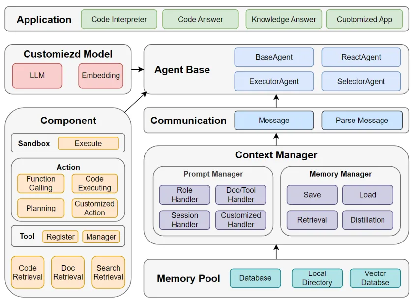

## Abstract

For complex SOPs requiring constant redefinition of agents and numerous post-processing stages, this procedure can become cumbersome and challenging. Striving to lift this weight and accelerate the execution of SOP workflows，this system streamlines the construction process with a suite of core components, enabling a more convenient and rapid build procedure. It spares users the need to delve into the intricacies of internal prompt construction logic. At last, The paper highlights muAgent's implementation for automating Code Q&A functionalities within Java code repositories, enabling query execution, API documentation, and test case generation.

### Introduction

In these rapidly progressing times of informational prowess, we are witnessing the remarkable potential of Large Language Models (LLMs) in expertly navigating and disentangling intricate issues. However, challenges of a more sophisticated nature, such as untangling the knots in programming intricacies, often prove too intricate for a singular LLM Agent to tackle effectively. To bridge this gap, there has been an inspiring movement within the tech community towards the fusion of multiple Agents, orchestrating their collaborative talents to decipher these complex puzzles.

At the core of a Multi-Agent system is the understanding that focus needs to extend beyond just developing the Agents—it must also include the strategic development of a Standard Operating Procedure (SOP) specifically designed for the task at hand. This approach is based on a deep comprehension of the task's unique requirements, ensuring the system is fine-tuned for peak performance.

But how exactly does muAgent utilize multi-agent collaboration to complete tasks? As we know, the creation of an agent typically involves careful formulation of prompts, which are processed by the LLM for execution. The output received is then treated with specific logic before being integrated into the next agent's prompt, triggering its response. This cycle repeats until the completion of the task. For complex SOPs requiring constant redefinition of agents and numerous post-processing stages, this procedure can become cumbersome and challenging.

Striving to lift this weight and accelerate the execution of SOP workflows, muAgent has been expertly equipped with some modules. These innovative features are designed to manage extensive interaction histories and simplify the prompt creation process. This process involves interpreting LLM outputs, enacting precise actions, and deftly managing the information cascade.

### Modules

<div align=center>
  
</div>

Now, let's explore modules within muAgent.

#### Communication

The seamless flow and exchange of information are vital in enhancing the interactions between agents. To facilitate this crucial process, the structure for the dissemination of information has been carefully divided into distinct categories: System Content, Info Content, LLM Content, and LLM Parsed Content.

System Content functions as the critical scaffold for metadata, providing a structural backbone that supports the entire information exchange framework. Moving deeper into the informational strata, Info Content serves as a treasure trove of auxiliary insights, ranging from expansive knowledge bases to nuanced tool understandings. LLM Content stands as the central conduit for data flow between agents, delivering unfiltered outputs that enable direct and immediate sharing of information. Finally, the refinement process culminates with LLM Parsed Content, where raw LLM outputs are transformed into a more navigable key-value format.

By categorizing the exchange of information into these meticulously defined segments, the communication fabric among agents has been notably augmented. This strategic segmentation ensures the fluid and efficient transmission of crucial data, empowering each agent to excel in their designated functions with unprecedented cohesion and clarity.

#### Memory Manager

Memory plays a quintessential role in the advanced functionality of MuAgent, with its capabilities forming the cornerstone of intelligent data handling, enabling agents to navigate extensive databases with exceptional ease and accuracy.

The feature of Storage Management is integral to this process. It acts as the vault for archiving the intricacies of dialogue, including the breadth of user inputs, the nuanced responses generated by LLMs, and the subtle observations captured during interactions. the sophisticated process of Information Compression can distill the sprawling chat history into a more streamlined context format. Memory Retrieval offering foundational search tools that swiftly hone in on critical pieces of information pertinent to ongoing inquiries.

The amalgamation of these memory features within MuAgent not only streamlines the experience but also elevates the level of interactivity.

#### Promt Manager

At the heart of muAgent's formidable intellect lies the Prompt Manager, strategically designed to facilitate the harmonious interplay among various sophisticated models. This component is much like the central brain of the system, where it meticulously analyzes and refines complex business inquiries into focused prompts, perfectly suited for accurate guidance and effective problem-solving. The Prompt Manager within muAgent is divided into three main sections, each with its own distinctive purpose: System Prompt, Context Prompt, and Customized Prompt.

The System Prompt encompass vital information like Role and Task definitions. This sets clear expectations and objectives for the model, laying the groundwork for its operations. Progressing to the Context Prompt, it introduces essential background or situational details necessary for the model to fully understand the nature of the inquiry. The Customized Prompt section is where specially crafted inputs meet explicit output guidelines, addressing the specific types of data the model needs to process and dictating the desired format or structure of the output.

Through these three compartmentalized yet integrated segments, empowers muAgent to function as a versatile and intelligent facilitator of tasks, seamlessly adapting to varied user demands with unparalleled adeptness.


#### Agent Type

To meet the diverse requirements of interaction processes, muAgent provides a suite of specialized agent types, each with its core capabilities designed to enhance overall system productivity and user experience.

Regarded as the workhorse of the muAgent ensemble, the BaseAgent boasts expertise in fundamental operations, such as overseeing question and answer exchanges, skillful tool utilization, and proficient code execution. The ReactAgent, true to its name, is well-versed in standardized ReAct flows, enabling it to deftly handle routine interchanges with structured, predefined reactions. The ExecutorAgent orchestrates the completion of these tasks in a methodical and sequential manner, providing systematic follow-through on the tasks at hand. With decision-making prowess, the SelectorAgent assumes the critical role of arbitration—determining which agent within the ensemble is best suited for responding to inquiries put forth by users or other agents.

By delineating roles and responsibilities, muAgent ensures a user-focused approach to managing interactions and well equipped to offer tailored support across a broad spectrum of tasks and processes.


#### Ecosystem Components

The muAgent framework is enriched by three pivotal Ecosystem Components that are integral to its operation: Retrieval, Tool, and Action. Retrieval can be envisioned as the erudite librarian of your digital consortium—a gatekeeper of information. Tool, on the other hand, is akin to a digital Swiss Army Knife—a comprehensive collection of utilities poised at the ready. Agents within the framework can register a variety of tools, seamlessly interfacing with the langchain Tool, thereby enhancing their practical capabilities manifold. Lastly, Action embodies the concrete steps, represents the dedicated tasks or the sequence of operations that the LLM is primed to carry out.

With Retrieval providing the right information, Tool equipping the agent with necessary utilities, and Action orchestrating their use, muAgent transforms complex instructions into concrete, impactful results—ultimately setting a new standard in digital interaction and task automation.

### Feature Demonstration

To start using muAgent, you can typically install it using Python's package manager. `pip install codefuse-muaget`

After installation, you are able to import and use the functionalities provided by the muAgent framework in your Python scripts and applications.

Implementing Code Q&A Capabilities for Local Code Repositories within muAgent

1、MuAgent now supports the integration of Java code repositories, which it proficiently transforms into vectorized data, graph-based structures, and conventional database content.

```python
# initialize codebase
codebase_name = 'client_local'
code_path = "D://chromeDownloads/devopschat-bot/client_v2/client"

use_nh = True
do_interpret = True
cbh = CodeBaseHandler(codebase_name, code_path, crawl_type='dir', use_nh=use_nh, local_graph_path=CB_ROOT_PATH,
                      llm_config=llm_config, embed_config=embed_config)
cbh.import_code(do_interpret=do_interpret)
```


2、After setting up the code repository, we can harness the power of language models to carry out queries and provide responses based on the codebase.

```python
#
phase_name = "codeChatPhase"
phase = BasePhase(
    phase_name, embed_config=embed_config, llm_config=llm_config,
)

#
query_content = "remove 这个函数是做什么的"
query = Message(
    role_name="user", role_type="human", input_query=query_content,
    code_engine_name=codebase_name, score_threshold=1.0, top_k=3, cb_search_type="tag",
    local_graph_path=CB_ROOT_PATH, use_nh=use_nh
    )
output_message3, output_memory3 = phase.step(query)
# print(output_message3)
print(output_memory3.to_str_messages(return_all=True, content_key="parsed_output_list"))
```


3、Following the integration, a significant benefit we harness is the transformation of the code repository into API documentation, alongside the automatic generation of test cases.


A visual demonstration can often make it easier to grasp the platform's capabilities. It would be beneficial to watch video to get a clearer understanding of how CodeFuse-Chatbot works in practice of Q&A features.

> [https://www.youtube.com/watch?v=ex5sbwGs3Kg&ab_channel=HaotianZhu](https://www.youtube.com/watch?v=ex5sbwGs3Kg&ab_channel=HaotianZhu)

The muAgent framework supports private customization. Whether it's a personalized LLM or a embedding service, the capability is at your fingertips!

Join hands with the muAgent framework to unlock new potential in the programming world and experience an explosion of creativity!

> Related Github Repos
>
> [1] https://github.com/codefuse-ai/CodeFuse-muAgent
>
> [2] [https://github.com/codefuse-ai/codefuse-chatbot](https://github.com/codefuse-ai/codefuse-chatbot)
>
> [3] [https://github.com/codefuse-ai](https://github.com/codefuse-ai)
